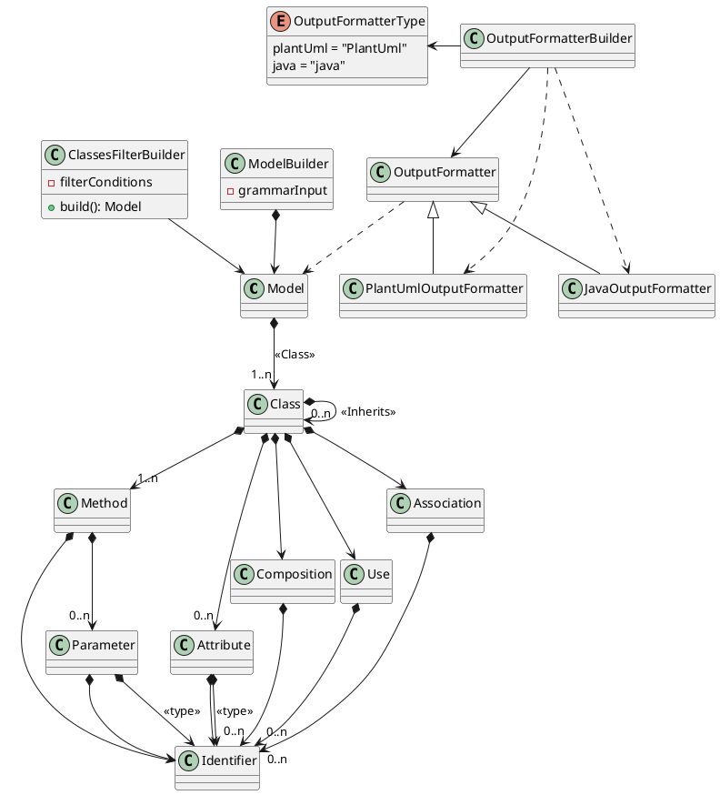

[# Referencia] https://es.wikipedia.org/wiki/Notaci%C3%B3n_de_Backus-Naur

# Class Diagram
## Sentences

\<creation> ::= \<action> [visibility] \<object> \<object-name>
- create class Vehicle
- create public class Car
- create public class Engine
- create interface Startable
  
\<responsabilities> ::= \<object-name> \<verb> \<object-name>
- Car can SpeedUp (crea método)
- Car can Stop (create método)
- Car knows isStarted (create atributo de lista)
- Car is Vehicle (aplica herencia)
- Car implements Startable (aplica implementación por interface)
- Car has Seats (relación por agregación)
- Car is asociated with Wheels
- Car uses MusicSource (relación por uso, por ej Pendrive, CD)
- Car is composed of Engine (relación por composición)
  
\<scoope> ::= \<object-name> \<verb> [visibility]
- Car is public
- wheel is private

## Example 1
Car is Vehicle -> Vehicle <|-- Car

Car has Seats -> Car o-- Seats : aggregation

## Example 2

create class Car

can SpeedUp

can Stop

end

# Diagrama de clases de software de lo que sería una aproximación de la idea que queremos plantear de tener diferentes formatos de salida, pero también diferentes filtros sobre el modelo

[PlantUml model](//www.plantuml.com/plantuml/png/XLDDZzem4BtFhx1oweSIjLT48rea92gXSYW_m11JNFaZiYShhTZzxsix2JPUh3s0XpTlPfxncvL5Qd2G0k0agBLafpico1K88V0wOTkEAUHdpWovpjYU6YePfj1FHCEF0x88xHXUT1T_hxNijUN8jOhWmRAaYRNwnEdCI5Nz6hZec0dYwdzklAHcg_e1dT2P-6T01soqaHITk5ZYA4mDCYVyVUuP2HrxGHKUf20_IBMVuihX_-aJzPW_gsJIsdypk-72pqcbdGEqrgeB5xKE-thqX4-V5-DDGXk0krjzgUjsoew94Qc-DusgncaBibo6e6qXd1FbsprbgoxCSFIizxJuId2BGZvvvNB6jqVtbqK1KUFqs30UUUK4frAYX-0MvMN5J45AOZ18udHisZrMfiQ39FwuqliNtAV490I0vBuZovUw9hFFicI9_jjPCAS252plnUJa4bMmCqPwkXkbagPfY-hB9Ozla061E2t2moLB5cN5L3T8yGO0)

